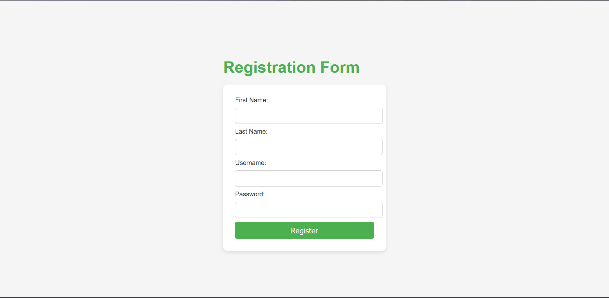
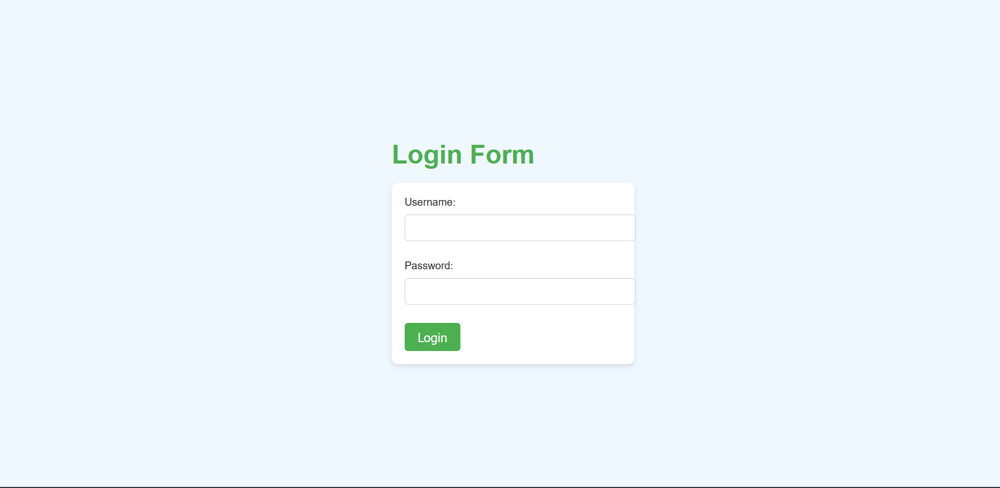

# Servlet Form Project  

## Overview  

The **Servlet Form** project is a web application that allows users to register and log in through a simple and intuitive user interface. It is developed using Java servlets and provides a web-based interface for user registration and authentication.  

## Table of Contents  

1. [Technologies](#technologies)  
2. [Folder Structure](#folder-structure)  
3. [User Interfaces](#user-interfaces)  
   - [Index Page](#index-page)  
   - [Sign Up Page](#sign-up-page)  
   - [Login Page](#login-page)  
   - [Welcome Page](#welcome-page)  
4. [Database Connection](#database-connection)  
5. [How to Run the Project](#how-to-run-the-project)  

## Technologies  

- Java EE (Servlets)  
- HTML/CSS for front-end design  
- Apache Tomcat (for deployment)  
- MySQL (for database)  

## Folder Structure

RegistrationForm/
├── Deployment Descriptor: RegistrationForm
├── JAX-WS Web Services
├── Java Resources
│ └── src/main/java
│ ├── Libraries
│ └── ...
├── build
├── src
│ ├── main
│ │ └── java
│ │ ├── auth
│ │ │ ├── loginUser.java
│ │ │ └── registerUser.java
│ │ └── util
│ │ └── DatabaseConnection.java
│ └── webapp
│ ├── META-INF
│ │ └── MANIFEST.MF
│ └── WEB-INF
│ ├── lib
│ └── ...
│ ├── index.html
│ ├── web.xml
│ ├── welcome.html
│ ├── login.html
│ └── signup.html

## User Interfaces  

### Index Page  

   

- **URL:** `index.html`  
- **Description:** This is the landing page of the application. It provides links to the Sign Up and Login pages.  
- **Features:**  
  - Navigation links to register and log in.  
  - Simple and user-friendly layout.  

### Sign Up Page  

    

- **URL:** `signup.html`  
- **Description:** This page allows new users to create an account by entering their information.  
- **Fields:**  
  - **Username:** The desired username for account access.  
  - **Password:** A secure password for account protection.  
  - **Email:** A valid email address for account verification and notifications.  
- **Button:**  
  - **Register:** Submits the form to the `registerUser.java` servlet for processing.  

### Login Page  

    

- **URL:** `login.html`  
- **Description:** This page allows existing users to log in.  
- **Fields:**  
  - **Username:** User's registered username.  
  - **Password:** User's password.  
- **Button:**  
  - **Login:** Authenticates the user by calling the `loginUser.java` servlet.  

### Welcome Page  

    

- **URL:** `welcome.html`  
- **Description:** This page is displayed after a successful login. It welcomes the user and may offer additional information or navigation options.  
- **Features:**  
  - Display of the user's name or welcome message.  
  - Links to log out or access other parts of the application.  

## Database Connection  

- **File:** `DatabaseConnection.java`  
- **Description:** This class manages the connection to the database. It handles all operations related to connecting and querying the MySQL database.  
- **Functions:**  
  - Establishes a connection to the database.  
  - Executes SQL queries for registering and authenticating users.  

## How to Run the Project  

1. **Setup Your Environment:**  
   - Ensure you have a Java Development Kit (JDK) installed.  
   - Install Apache Tomcat for servlet deployment.  
   - Set up a MySQL database to store user information.  

2. **Import the Project:**  
   - Clone or download the project from GitHub.  
   - Import the project into your IDE.  

3. **Configure Database:**  
   - Update the database connection settings in `DatabaseConnection.java` with your database credentials.  

4. **Deploy on Tomcat:**  
   - Package the project as a WAR file.  
   - Deploy the WAR file to your Tomcat server.  

5. **Access the Application:**  
   - Open a web browser and navigate to `http://localhost:8080/RegistrationForm/index.html` to access the application.  

## Conclusion  

The **RegistrationForm** project aims to provide an easy and secure user registration and login experience. With a clean user interface and a robust backend, it serves as a foundation for web-based user management.  
